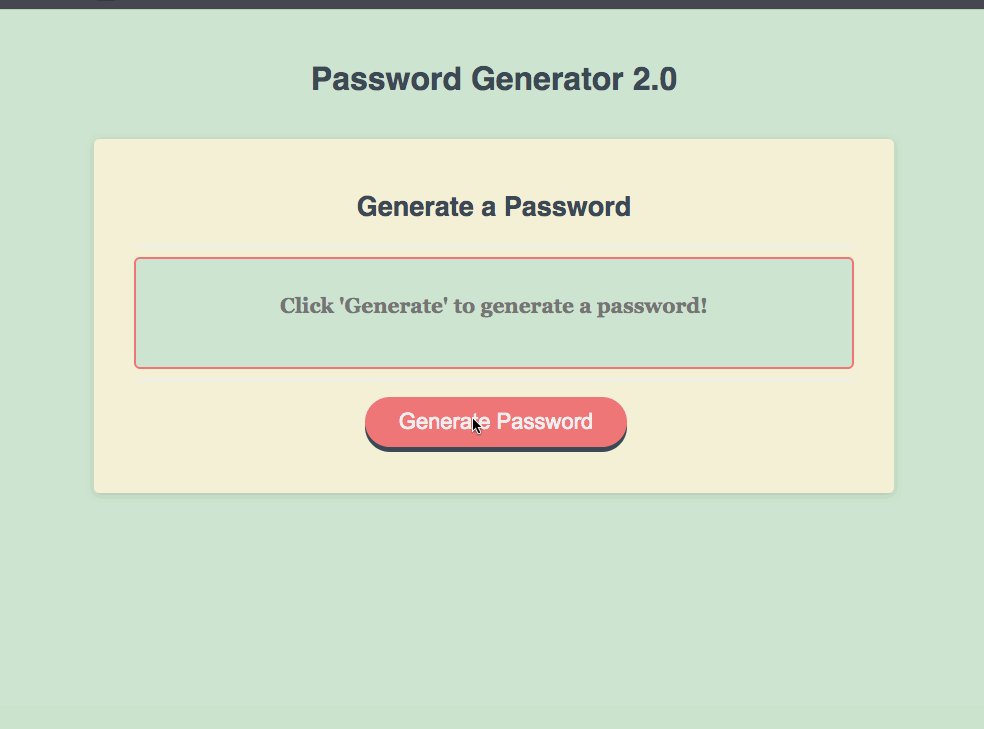

# Password Generator 2.0 **([Link](https://mstephen19.github.io))**

This is a web-app that randomly generates a secure password based on various criteria provided by the user. The user can choose whether or not to include lowercase characters, numbers, or special characters. The user can also choose how many characters they want in the password, as well as copy the generated password in one click.



## Built With

* [HTML](https://developer.mozilla.org/en-US/docs/Web/HTML)
* [CSS](https://developer.mozilla.org/en-US/docs/Web/CSS)
* [Javascript](https://developer.mozilla.org/en-US/docs/Web/JavaScript)
* [ColorHunt](https://colorhunt.co/palette/cee5d0f3f0d7e0c097ff7878) (color pallete)
* [Mohamad El-Husseini](https://codepen.io/abitdodgy/pen/hmgai) (Shake animation)

## Notable Stuff

### Javascript logic used to copy password and display copied password confirmation:

``` Javascript
document.getElementById('password').addEventListener('click', function(){
  document.getElementById('password').select();
  //i know execcommand is deprecated but idk how else to do this tbh
  document.execCommand('copy');
  document.querySelector('h3').style.opacity = "100"
  setTimeout(function(){document.querySelector('h3').style.opacity = "0";}, 1000);
})
```

### Generate password utilizing chatAt, since strings act like arrays in JS:
``` JavaScript
  console.log(usedCharacters)
  for(let i = 0; i < charsWanted; i++){
    generatedPassword += usedCharacters.charAt(Math.floor(Math.random() * usedCharacters.length))
  }
```

## Deployed Link

* [Live Site Here](https://mstephen19.github.io/BCBPWGEN/)

## Author

**Matt Stephens** 

- [Link to Portfolio Site](https://mstephen19.github.io)
- [Link to Github](https://github.com/mstephen19)
- [Link to LinkedIn](https://www.linkedin.com/mstephen19)

### Acknowledgments

* Shoutout to [Jesse Lewis](https://www.linkedin.com/in/jesseaustinlewis/) for teaching me basic Regex stuff
* [This StackOverflow page](https://stackoverflow.com/questions/23476532/check-if-string-contains-only-letters-in-javascript) helped me a lot with detecting characters within number field